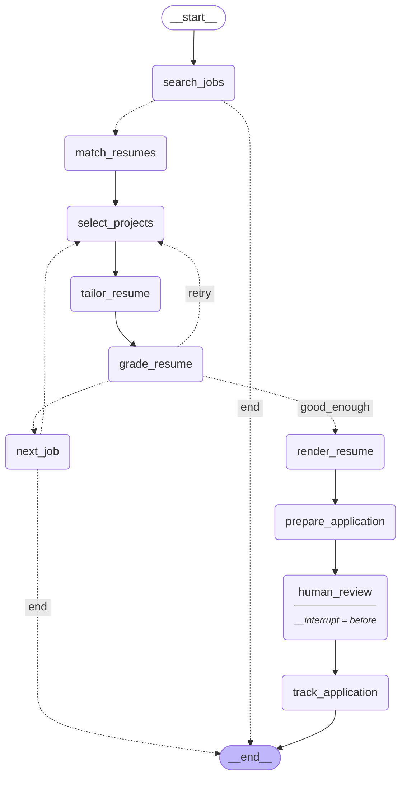

# JobPilot-AI

An agent that finds US data and AI jobs, tailors a résumé to each one, fills in
the real application form in a browser, and stops so a human clicks Submit.
Every application is logged to a spreadsheet.

Built on LangGraph. Runs on OpenAI or Google Gemini — one setting switches
between them.

```
you: "gen AI roles"
  ↓
28 title variants · 8 company boards · US-only · seniority-checked
  ↓
best résumé variant + 3 real projects chosen for this JD, tailored, scored
  ↓
PDF rendered · browser opens · form filled
  ↓
⏸  you review and submit
  ↓
logged to Excel
```

---

## Quick start

```bash
python3 -m venv venv
./venv/bin/pip install -r requirements.txt
./venv/bin/playwright install chromium
cp .env.example .env          # add your API key
./venv/bin/python run.py
```

WeasyPrint needs system libraries:
`brew install pango` (macOS) · `apt-get install libpango-1.0-0 libpangocairo-1.0-0` (Ubuntu)

Before the first run, create your profile from the example and fill it in:

```bash
cp data/candidate_profile.example.json  data/candidate_profile.json
cp data/resumes/gen_ai.example.json      data/resumes/gen_ai.json
cp data/resumes/data_analytics.example.json data/resumes/data_analytics.json
```

Your identity and every application answer live there. That file is gitignored
and must stay that way — it holds your phone number, visa status and EEO
answers, and none of that belongs in a public repository.

To test one piece without running the whole pipeline:

```bash
./venv/bin/python check.py           # list the checks
./venv/bin/python check.py free      # everything that costs nothing
./venv/bin/python check.py location  # just the US filter
```

---

## The graph

Ten nodes, two cycles, one interrupt. This diagram is generated from the
compiled graph, so it cannot drift out of date with the code:

```bash
./venv/bin/python draw_graph.py          # mermaid, as below
./venv/bin/python draw_graph.py ascii    # terminal diagram
./venv/bin/python draw_graph.py edges    # plain node/edge listing
./venv/bin/python draw_graph.py png      # output/graph.png
```



Solid arrows are unconditional. Dotted arrows are conditional edges, labelled
with the branch they take.

### The two cycles

**Cycle 1 — exploration.** `grade_resume` scores the tailored résumé against
the JD, then loops back to *selection*, not tailoring: the fix is to surface a
different real project, never to reword harder. It runs the full budget of
`MAX_ATTEMPTS` combinations every time and applies with the **highest-scoring
one**, not the first acceptable one — a 91 found on the third combination is a
better résumé than the 86 that happened to come up first, and since the scorer
is deterministic and free, the only cost of looking is the select + tailor
calls. `select_content` is told which combinations have already been scored,
and `_force_new_combination` swaps a project deterministically when the model
returns a set it has already given, so no pass is spent re-scoring the same
résumé.

The one early exit is a **perfect 100**, and it is not a threshold judgement:
at 100 every JD requirement the candidate could evidence is already on the
résumé, so no other combination can beat it. Everything below 100 keeps looking.

**Cycle 2 — job skipping.** If the *best* of those combinations is still under
70, the JD genuinely doesn't line up with the candidate's history. `next_job` abandons
that posting and moves to the next candidate rather than spending an
application on a poor fit.

### The interrupt

`interrupt_before=["human_review"]` makes `invoke()` return before that node
runs. `run.py` then opens the browser, fills the form, and blocks on a typed
confirmation. Only after that does `app.invoke(None, thread)` resume the graph
from where it stopped, and the application gets logged.

State is checkpointed to SQLite because LangGraph requires a checkpointer for
interrupts. It is not used for crash recovery: a run is a handful of LLM calls
and under a minute, so re-running is cheaper than the complexity of resuming.

---

## The files

Execution order, top to bottom:

| # | File | Lines | What it does |
|---|---|---|---|
| 1 | **run.py** | 173 | Entry point. Asks what you're looking for, builds the graph, runs it, opens the browser, holds the human checkpoint, resumes the graph to log. |
| 2 | **agent.py** | 504 | The graph itself: `State`, the output schemas, all 10 node functions, the routing conditions, `build_graph()`. |
| 3 | **helpers.py** | 564 | Tools the nodes call. LLM access with failover, Greenhouse search, the US filter, salary/date/experience logic, PDF rendering, the Excel tracker. |
| 4 | **llm_tasks.py** | 658 | Every decision the model is allowed to make, batched and schema-validated. |
| 5 | **scoring.py** | 355 | Citation verification, the invention guard, and the score arithmetic. No LLM anywhere in this file. |
| 6 | **apply.py** | 451 | Browser automation. Reads the form, fills it, never submits. Imports nothing from the rest of the project. |
| — | **check.py** | 308 | Test any single piece without running the pipeline. |

### What each one is for

**`run.py`** — the only file you normally edit. `COMPANY_BOARDS` is the list of
Greenhouse boards to search; `DEFAULT_INTENT` is what you get by pressing Enter
at the prompt. It also owns the human checkpoint, which refuses to proceed
unless stdin is a real terminal — silence must never count as approval.

**`agent.py`** — imports `helpers`, `llm_tasks` and `scoring`, and wires them
into nodes. Each node takes the state, does one job, and returns a partial
update. Nothing here talks to the network directly.

**`helpers.py`** — five sections: LLM access (`call_llm` is the single provider
swap point), job search and the US filter, small deterministic calculations,
PDF rendering, and the tracker. Every function works standalone.

**`llm_tasks.py`** — `expand_query` turns an intent into title variants,
`judge_jobs` screens candidates for fit and seniority in one batched call,
`select_content` picks projects, `answer_form` answers a whole application form
in a single call. All return validated Pydantic objects.

**`scoring.py`** — verification and arithmetic. The model supplies evidence;
this file decides the number. `verify_and_score` checks every citation against
the real résumé, `introduced_terms` is the anti-invention guard, and the old
keyword scorer is kept as a diagnostic. No LLM call is made from this file.

**`apply.py`** — imports only `re` and `pathlib`. It receives a finished
dictionary and a callback, and knows nothing about profiles, LangGraph, or
which model is in use. That boundary is why the browser layer can be tested and
replaced on its own.

### Data

| Path | Contents |
|---|---|
| `data/candidate_profile.example.json` | Placeholder profile, committed. Copy it to create your own. |
| `data/candidate_profile.json` | Identity, application answers, screening answers. The source of truth for every fact. **Gitignored — never commit it.** |
| `data/experience_pool.json` | Every real project. `select_projects` chooses from these per job. |
| `data/resumes/*.json` | Two base variants — experience and skills. |
| `templates/resume.html` | Jinja + print CSS. Code owns the layout. |
| `output/resumes/` | `<Name>_<Company>_<Role>.pdf` — the role is in the filename because one company can have several open roles. |
| `output/` | `applications.xlsx`, checkpoints, cached answers, the last fill report. Gitignored. |

---

## Design decisions

**The model supplies evidence; code computes the score.**
The scorer does not ask "how good is this résumé" — a model grading work it just
produced returns a flattering number. It asks the model to name what the JD
requires and then *quote the résumé line that proves each one*, and
`verify_and_score` checks every quotation against the actual résumé. Paraphrased
or invented citations are recorded as `fabricated` and count as **not met**, so
the only way the number rises is for a real bullet to genuinely cover a real
requirement. Requirements are extracted **once per job** and reused for every
project combination, so "best of three" compares three attempts at the same exam
rather than three different ones.

The keyword scorer this replaced graded a 7,473-character JD against five terms
— `ai`, `llm`, `api`, `mcp`, `python`, with `ai` alone worth 75% — and returned
100/100 for a résumé that met 4 of 15 real requirements. Project choice moved it
by at most 15 points, which is why the exploration loop returned identical
scores three passes running.

**Facts come from the file; the model supplies wording.**
Work authorisation, sponsorship, visa status and EEO answers are read from
`candidate_profile.json` and passed to the model as ground truth. It maps a
known fact onto a form's phrasing — given *"I am not a protected veteran"* it
selects *"I have never served in the military"* — but it never decides the fact.

**The model edits content; code owns formatting.**
Résumés are JSON. A fixed HTML template renders them. Tailoring can reword a
bullet; it cannot change the layout.

**Selection, not generation.**
Tailoring only rewords bullets that already exist, and the retry loop raises the
score by choosing a *different real project*, never by adding a claim.
`introduced_terms` enforces it after the fact: every content word on the finished
page must already appear somewhere in the candidate's source files, and one that
does not was put there by the rewrite. It deliberately does not ask whether a
word *looks* like a technology — the shape-based version it replaced caught
`HashiCorp` and `SHA-256` but walked straight past `Kubernetes` and `Terraform`.

**Some questions are never the model's to answer.**
`NEVER_ANSWER` blocks arbitration agreements, signatures, initials, background
check consent, and "I agree / I certify" phrasing. This is policy, not
judgement: you don't *ask* a model whether to sign something, because the answer
might be yes. Checkboxes and radios are never ticked at all.

**429 and 503 need opposite responses.**
A 429 means this key's quota is spent — rotate keys immediately, with no
backoff, because it won't clear for 24 hours. A 503 means the model is
overloaded — rotate models, since every key hits the same one. `call_llm()`
walks models × keys.

**Every network call has a timeout.**
Without one a stalled connection blocks forever inside `SSL_read` and no
exception is ever raised, so retry logic never fires. Observed in practice: a
run sat at 0% CPU for five minutes.

**US-only, strictly.**
Each location in a posting is judged separately, and every non-US signal is
checked before any US one — otherwise `"New York, NY;Toronto, Ontario, CAN"`
matches on the US half and the Canadian site comes along with it. Only the US
parts are kept and displayed. `"Berlin, DE"` is Germany; `"Manchester, NH"` and
`"Paris, TX"` stay.

**It never clicks Submit.**
There is no submit-click anywhere in the codebase.

---

## Known limits

- **Hosted Greenhouse forms only.** If a posting's `absolute_url` is on
  `greenhouse.io` the auto-fill works. Companies that redirect to their own
  careers site open in the browser but the fields won't match.
- **Single-page forms only.** Multi-page flows such as Workday are not handled.
- **Only the first 40 candidates are judged** (`JUDGE_BATCH_LIMIT`). On a wide
  search the rest are dropped.
- **The pool is the ceiling, and only 3 of it ship.** Selection can only surface
  what is in `experience_pool.json`, and `select_content(n=3)` puts three
  projects on the résumé — so most of the pool is unused on any given
  application by design. If a JD wants a technology no project evidences, the
  score stays low and the job is skipped rather than the gap being invented.
- **The model can be confident about facts it cannot know.** It has been seen
  answering "have you interviewed here before?" with no basis for it. Questions
  like that belong in `NEVER_ANSWER` or in the profile.
- **Verification is manual**, via `check.py`. There is no automated test suite.

---

## Configuration

`.env`:

```
LLM_PROVIDER=openai              # or: gemini
OPENAI_API_KEY=sk-proj-...
OPENAI_MODEL=gpt-4o-mini
OPENAI_FALLBACK_MODELS=gpt-4.1-mini,gpt-4o
GOOGLE_API_KEYS=key1,key2        # comma-separated, rotated on quota exhaustion
GEMINI_MODEL=gemini-flash-latest
```

Thresholds live in `scoring.py`:

```python
TARGET_SCORE       = 60   # what a good tailoring should reach — reported, not a stop
MIN_SCORE_TO_APPLY = 40   # the BEST attempt must clear this or the job is skipped
MAX_ATTEMPTS       = 3    # how many different project combinations to try per job
PERFECT_SCORE      = 100  # the only early exit — nothing above it exists
```

Calibrated against 6 real postings × 2 résumé variants: best-per-job came out
**43–68, median 50**. Verified scoring is a much harsher scale than keyword
counting, so these are not the old numbers renamed — carrying 70/85 across would
have skipped every job. Recalibrate if you change the pool substantially.

Raising `MAX_ATTEMPTS` explores more combinations and usually finds a higher
score, at two extra LLM calls per pass.
